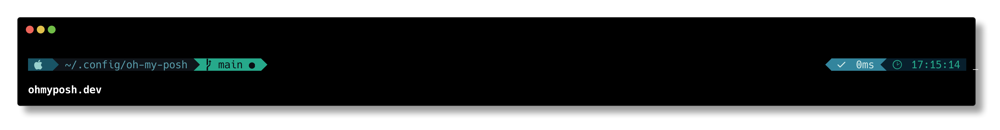

## Gotham theme for Oh My Posh

Configuration file for [Oh My Posh](https://ohmyposh.dev) based on [vim-gotham](https://github.com/whatyouhide/vim-gotham) colorscheme.



### Usage

Once you have Oh My Posh properly installed, clone this repository preferably to your `~/.config` folder;

```sh
git clone https://github.com/acauamontiel/oh-my-posh-gotham ~/.config/oh-my-posh
```

And then put this code snippet into your Shell initialization file, mine is `.zshrc`;

```sh
eval "$(oh-my-posh init zsh --config '~/.config/oh-my-posh/gotham.json')"
```
